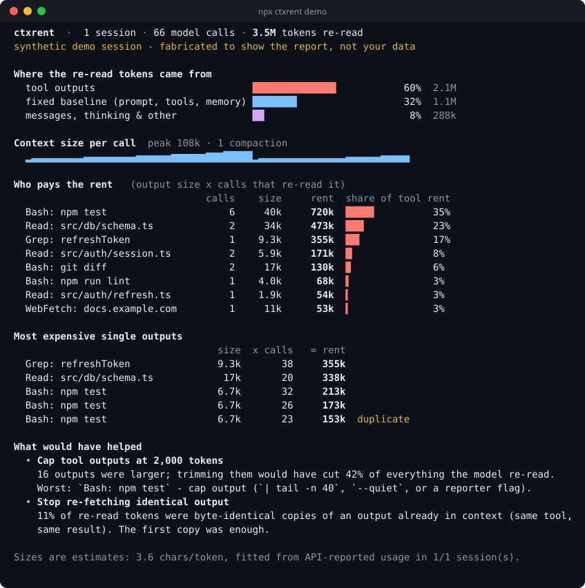
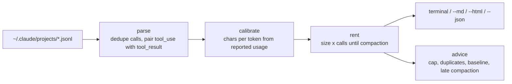

<div align="center">

# ctxrent

**Every tool output in your AI coding session pays rent for as long as it stays in the context window.**
`ctxrent` shows you who's paying the most.

[](https://github.com/Nithinfgs/ctxrent/actions/workflows/ci.yml)
[](LICENSE)
[](package.json)
[](package.json)



<sub>Output of <code>ctxrent demo</code> on a synthetic session, so you can see the report without installing Claude Code.</sub>

</div>

## The 20-second version

A coding agent doesn't read a tool output once. The whole conversation is sent back to the model on **every** later call, so a 10k-token `npm test` dump that lands at call 5 is re-read at calls 6, 7, 8, ... until the context is compacted or the session ends.

`ctxrent` reads your local Claude Code transcripts and, for each tool output, computes:

```
rent = size of the output  x  number of later model calls that re-read it
```

Then it ranks commands, files and MCP tools by rent, flags byte-identical repeats, and tells you what trimming would have saved. Everything runs locally. Nothing is uploaded and no API key is needed.

## Quick start

```bash
# See a sample report, no setup, no Claude Code needed
npx github:Nithinfgs/ctxrent demo

# Analyze your own recent sessions (reads ~/.claude/projects)
npx github:Nithinfgs/ctxrent

# Just the newest session, with a shareable HTML report
npx github:Nithinfgs/ctxrent --last --html report.html
```

Or clone it (requires Node 22+; there are no runtime dependencies and no build step):

```bash
git clone https://github.com/Nithinfgs/ctxrent && cd ctxrent
node bin/ctxrent.js demo
```

> A `npx ctxrent` shortcut will work once the package is published to npm (see the [roadmap](#roadmap)).

## Why this exists

Token-usage tools tell you _how much_ you spent. They rarely tell you _which thing in the conversation caused it_. Most of a long agent session is not your prompts or the model's answers; it is tool output being carried forward turn after turn: a test runner printing 600 passing tests, the same 1,200-line file read twice, a `grep` that matched everything.

Prompt caching makes re-reads cheaper per token, not free, and they still fill the window and count toward limits. The fix is usually small (`| tail -n 40`, a line range on a `Read`, a narrower `grep`) but you can't fix what you can't see. `ctxrent` makes the carry cost visible, per command, so you know which habit is worth changing.

## Example

```console
$ ctxrent --project . --since 7
Who pays the rent   (output size x calls that re-read it)
                                 calls    size     rent  share of tool rent
  Bash: npm test                     6     40k     720k  ████▉          35%
  Read: src/db/schema.ts             2     34k     473k  ███▏           23%
  Grep: refreshToken                 1    9.3k     355k  ██▍            17%

What would have helped
  • Cap tool outputs at 2,000 tokens
    16 outputs were larger; trimming them would have cut 42% of everything the model re-read.
    Worst: `Bash: npm test` - cap output (`| tail -n 40`, `--quiet`, or a reporter flag).
```

(That output is from the synthetic demo. Run it on your own sessions to get real numbers.)

## Features

- **Rent per output, grouped the way you think**: `Bash: npm test`, `Read: src/db/schema.ts`, `Grep: refreshToken`, MCP tools by name.
- **Compaction-aware**: rent stops accruing when the context is compacted, detected from compaction markers or a sharp context drop.
- **Calibrated sizes**: output sizes are converted to tokens using a chars-per-token ratio fitted from the usage numbers the API already recorded in your transcript, not a fixed guess.
- **Duplicate detection**: flags byte-identical outputs that were already in context.
- **Concrete advice, no LLM**: a counterfactual ("trimming outputs over N tokens would have cut X%") plus rules for late compaction and a heavy fixed baseline. Every number is derived from the transcript.
- **Share-safe**: `--redact` hides paths, patterns and URLs; `--md` gives a paste-able summary; `--html` writes a single self-contained file with no scripts or network requests.
- **Fast and private**: streams transcripts, ~0.4s for 18 sessions / 4,000 model calls on a laptop. No telemetry.

## How it works



1. **Parse.** One API response is written to the transcript several times (once per content block); `ctxrent` merges them into one _call_ and records the context size the API reported for it (`input + cache read + cache creation`). Tool results are matched to the `tool_use` that produced them. Sub-agent records are ignored because they run in their own window.
2. **Calibrate.** Between two consecutive calls the context grows by roughly the new text plus the model's own output. The median ratio of characters to growth gives a per-session chars-per-token figure (falls back to 3.5 if there is too little data).
3. **Rent.** An output first appears in the next call after it arrives and stays until the next compaction or the end of the session. `rent = tokens x calls carried`.
4. **Attribute.** The total tokens re-read (the sum of context sizes) is split into tool-output rent, the fixed baseline of the first call (system prompt, tool schemas, memory files), and everything else (your messages, model output, thinking, injected reminders).

More detail and the exact formulas are in [docs/ARCHITECTURE.md](docs/ARCHITECTURE.md).

## Use cases

- "My session hit the context limit after an hour; what filled it?"
- Deciding which noisy commands deserve an output cap, a quieter flag, or a wrapper script.
- Comparing two workflows on the same task (`--md` output pastes cleanly into a PR or issue).
- Spotting that a large MCP tool or screenshot tool dominates your carry cost.
- Teaching a team why "just read the whole file" is expensive, with their own data.

## Options

| Option                  | What it does                                                           |
| ----------------------- | ---------------------------------------------------------------------- |
| `ctxrent [files...]`    | Analyze specific `.jsonl` transcripts instead of discovering them      |
| `ctxrent demo`          | Run on a built-in synthetic session (`--write FILE` saves its JSONL)   |
| `--last`                | Only the newest session                                                |
| `--project DIR`         | Only sessions recorded in `DIR` (default: all projects)                |
| `--since DAYS`, `--all` | Time window (default: last 14 days) or no limit                        |
| `--limit N`, `--top N`  | Max sessions (default 50) and rows per table (default 8)               |
| `--cap TOKENS`          | Output cap used for the savings estimate (default 2000)                |
| `--price USD`           | Price per million cache-read tokens; adds an approximate dollar figure |
| `--redact`              | Hide paths, patterns and URLs                                          |
| `--json`, `--md`        | Machine-readable or markdown output                                    |
| `--html FILE`           | Write a self-contained HTML report                                     |
| `--no-color`            | Plain output (also honors `NO_COLOR`; `FORCE_COLOR` forces color)      |

Environment: `CLAUDE_CONFIG_DIR` changes where transcripts are read from (default `~/.claude`). There is no config file.

Exit codes: `0` success, `1` no usable transcripts or a runtime error, `2` bad arguments.

It also works as a library: `import { parseSessionFile, buildReport } from 'ctxrent'`.

## Limitations (read these before quoting a number)

- **Sizes are estimates.** Tokenizers differ by content; the calibration is a fit, not a measurement. Treat percentages as "roughly", and rankings as more reliable than absolute values.
- **The transcript format is not a public API.** `ctxrent` reads Claude Code's local `.jsonl` files as of Claude Code in 2026 and skips records it doesn't understand. If a future version changes the format, parsing may degrade; please open an issue with a redacted sample.
- **Rent measures the window, not the invoice.** Cache-read tokens are billed at a fraction of normal input price and the ratio varies by model, so `--price` takes your number rather than guessing one.
- **Resumed sessions** count the restored history as part of the fixed baseline.
- **Sub-agents** run in separate windows and are not included in the parent's rent.
- Only Claude Code transcripts are supported today.

## Roadmap

- [ ] Publish to npm so `npx ctxrent` works directly
- [ ] Other agents' transcripts (Codex CLI, Gemini CLI, OpenCode)
- [ ] `--fail-above PCT` for CI/budgets on scripted agent runs
- [ ] Attribute baseline to individual MCP servers and memory files
- [ ] Interactive TUI with per-call drill-down

## Contributing

Issues and PRs are welcome, especially redacted transcript samples from other agents. See [CONTRIBUTING.md](CONTRIBUTING.md); the whole check suite is `npm run check`.

## License

[MIT](LICENSE)
